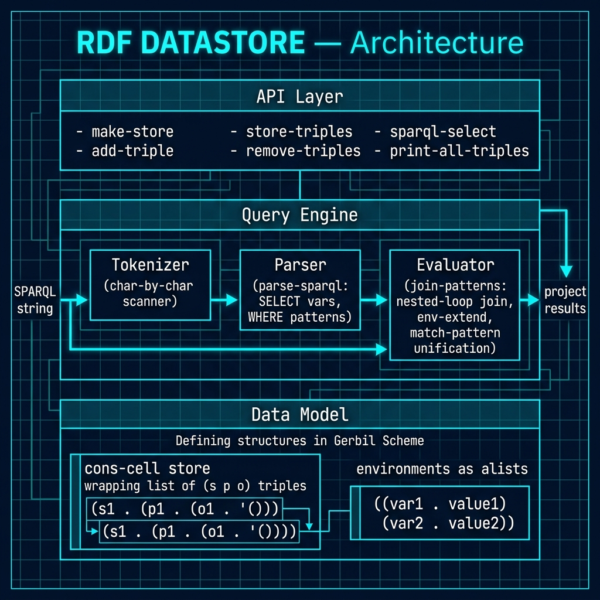

# A Simple In-Memory RDF Store and Query Language in Gerbil Scheme

## Introduction to RDF and the Goal of This Chapter

As we saw in an earlier chapter, the  Resource Description Framework (RDF)
is a W3C standard for representing
knowledge as a graph of statements.  Every statement is a *triple*: a
subject, a predicate, and an object.  Taken together, a collection of triples
forms a directed, labeled graph that can represent almost any kind of
structured knowledge — from social networks and bibliographic data to
scientific datasets and knowledge bases.

SPARQL is the standard query language for RDF graphs.  It lets you express
*patterns* of triples you are looking for, binding variables to the parts of
the graph that match.  A full SPARQL 1.1 engine is a substantial piece of
software, but the core idea — match a set of triple patterns against a store
and collect the variable bindings — is surprisingly straightforward to
implement from scratch.

This chapter walks through an implementation in **RDF.ss**, found in the directory
**gerbil_scheme_book/source_code/RDF_datastore**,
that is a self-contained Gerbil Scheme file that
implements both pieces: a mutable in-memory triple store and a small SPARQL
evaluator that handles the most commonly used fragment of the language.  The
goal is not to replace a production-grade triplestore, but to show how cleanly
the underlying ideas map onto idiomatic Scheme code.

We will list the complete implementation later; first we discuss our approach to writing a simple RDF data store with a simple but usable subset SPARQL query language.

## Data Model: Triples and the Store

The fundamental unit of RDF is the triple `(subject predicate object)`.  In
**RDF.ss** each triple is represented as a plain three-element Scheme list.
This is intentionally simple: lists are transparent, easy to inspect in the
REPL, and require no additional data-structure support from the runtime.

The store itself is a mutable wrapper around a list of those triples.  It is
created with `make-store` and manipulated through two mutating operations:
`add-triple` and `remove-triple`.  Both operations return the store itself,
which makes it natural to chain a series of `add-triple` calls when loading
data.  `store-triples` extracts the raw list for inspection or iteration.

Choosing a mutable design keeps the loading code simple and mirrors what a
developer would expect from a database: you add facts, you remove facts, and
the store reflects the current state of knowledge.  A persistent (immutable)
variant would be straightforward to build on top of the same ideas by
threading the store through every call rather than mutating it in place.

A small helper, `print-all-triples`, dumps the entire store to standard
output.  It is useful during development and debugging and is used in the
demo at the bottom of **RDF.ss** to show the loaded data before any queries
are run.


## Parsing SPARQL Queries

Before any matching can happen, the textual query string must be turned into
a structured representation the evaluator can work with.  **RDF.ss** handles
this in two stages: tokenization and parsing.

### Tokenization

The tokenizer in **RDF.ss** walks the query string one character at a time,
accumulating characters into a buffer and flushing the buffer into a token
whenever it encounters whitespace or one of the SPARQL punctuation characters
`{`, `}`, `.`, `,`, `;`, `(`, and `)`.  Each punctuation character also
becomes its own single-character token.  The result is a flat list of strings
that the parser can consume one element at a time without worrying about
character-level details.

Apart from the single helper `char-whitespace?` (which checks for space, tab,
newline, and carriage return), the tokenizer depends on nothing but basic
Scheme list and string operations.

### Parsing

The parser implemented in `parse-sparql` consumes the token list produced by
the tokenizer and returns two values via `let-values`:

- **vars** — the list of variable names the query projects, or the single
  wildcard token `"*"` when the query uses `SELECT *`.
- **patterns** — the list of triple patterns from the `WHERE` clause, each
  represented as a three-element list of strings in the same `(s p o)` shape
  as stored triples.

The parser first scans forward to the `SELECT` keyword, then reads variable
tokens (anything beginning with `?`) or the `*` token until it hits a
non-variable.  It then scans to the opening `{` of the `WHERE` block and
reads groups of three tokens as triple patterns, discarding optional trailing
`.` separators and stopping at the closing `}`.

The parser deliberately treats every token as a plain string after lowercasing
— resources, literals, and variables are all strings.  This avoids the need
for a separate IR type hierarchy and keeps the code focused on the structural
logic rather than on data representation.

One subtlety worth noting: the parser lowercases all tokens before processing.
This means variable names like `?Friend` and `?friend` are treated as
identical inside the engine, and resource strings like `<ex:Alice>` become
`<ex:alice>` in the parsed patterns.  For a toy engine this is an acceptable
simplification; a production system would need to distinguish case-sensitive
IRIs from case-insensitive keywords.


The following architecture diagram illustrates the structure of the in-memory RDF store, showing the data flow from triple storage through SPARQL query tokenization, parsing, pattern matching, and result projection.



## Query Evaluation: Pattern Matching and Joining

The evaluator in **RDF.ss** works in terms of *environments* — association
lists that map variable name strings to the string values they have been
bound to.  An empty environment `'()` represents "no bindings yet" and is
the starting point for every query.

### Matching a Single Pattern against a Triple

`match-pattern` tries to unify one triple pattern with one stored triple
given an existing environment.  For each of the three positions (subject,
predicate, object) it applies one of two rules:

1. If the pattern element is a variable (detected by `var?`, which checks
   for a leading `?`), look the variable up in the current environment.
   If it is already bound, check that the bound value equals the triple's
   value at that position — a mismatch means the pattern fails.  If it is
   unbound, extend the environment with the new binding.

2. If the pattern element is a concrete value (a resource or literal), check
   that it is exactly equal to the triple's value at that position.  If not,
   the match fails.

The three checks are sequenced so that a failure at any position short-circuits the
rest: `e1` is the environment after checking the subject, `e2` after the
predicate (or `#f` if `e1` failed), and `e3` after the object.  The final
value `e3` is either a valid extended environment or `#f`.

The helper `env-extend` encapsulates the extend-or-check logic.  It uses
`assoc` to look up the variable; if a binding exists and matches, it returns
the unchanged environment; if a binding exists but conflicts, it returns `#f`;
otherwise it prepends a new `(var . val)` pair.

### Joining Multiple Patterns

A SPARQL `WHERE` clause typically contains more than one triple pattern, and
the results must satisfy *all* of them simultaneously.  `join-patterns`
implements this as a recursive nested-loop join:

- Start with a list of one empty environment.
- For the first pattern, try matching it against every triple in the store.
  Collect all the environments that survive (i.e., `match-pattern` returned
  non-`#f`).
- Recurse on the remaining patterns, passing those surviving environments as
  the new starting set.
- When no patterns remain, whatever environments are left are the solutions.

This is equivalent to computing a relational cross-product filtered by the
match conditions — a join.  Because each pattern can bind new variables, the
common variables between two patterns act as join keys automatically, without
any explicit join condition.

The algorithm is correct for any number of patterns, though its time
complexity is proportional to the product of the number of triples and the
number of patterns.  For a small in-memory store that is entirely acceptable.

### Projecting Results

Once `join-patterns` returns the list of surviving environments, `sparql-select`
projects each one down to the variables named in the `SELECT` clause.  For
each result environment, it calls `project-env`, which walks the selected
variable list and pulls out the corresponding value from the environment via
`env-lookup`.

When `SELECT *` is used, no projection is applied — the full environment is
returned as-is, which contains all variables that were bound during matching.

## Gerbil RDF Implementation

```scheme
;;; RDF.ss ── simple in-memory RDF data store with a toy SPARQL subset
;;;
;;; Supports:
;;;   make-store        – create an empty triple store
;;;   add-triple        – add an (s p o) triple
;;;   remove-triple     – remove a matching (s p o) triple
;;;   store-triples     – retrieve all triples from a store
;;;   sparql-select     – run a SELECT query (variables + WHERE patterns)
;;;   print-all-triples – display all triples for debugging
;;;
;;; SPARQL subset handled:
;;;   SELECT ?var1 ?var2 ... WHERE { s p o . s p o . }
;;;   SELECT * WHERE { ... }
;;;   Variables begin with '?'

(export make-store add-triple remove-triple store-triples
        sparql-select print-all-triples)

;;;; ──────────────────────────────────────────────────────────────────
;;;;  1.  Data model
;;;; ──────────────────────────────────────────────────────────────────

;; A store is just a cons-cell box wrapping a list of triples.
;; Each triple is a 3-element list: (subject predicate object).

(define (make-store) (cons 'rdf-store '()))

(define (store-triples st) (cdr st))

(define (add-triple st s p o)
  "Add the triple (s p o) to store ST; returns ST for chaining."
  (set-cdr! st (cons (list s p o) (cdr st)))
  st)

(define (remove-triple st s p o)
  "Remove the first triple matching (s p o) from store ST."
  (set-cdr! st
            (filter (lambda (t)
                      (not (and (equal? (car t)   s)
                                (equal? (cadr t)  p)
                                (equal? (caddr t) o))))
                    (cdr st)))
  st)

(define (print-all-triples st)
  "Display every triple in the store."
  (display "All triples:\n")
  (for-each (lambda (t)
              (display "  ")
              (display (car t))   (display " ")
              (display (cadr t))  (display " ")
              (display (caddr t)) (newline))
            (store-triples st))
  (newline))

;;;; ──────────────────────────────────────────────────────────────────
;;;;  2.  Tokenizer
;;;; ──────────────────────────────────────────────────────────────────

(define (char-whitespace? ch)
  (or (char=? ch #\space)
      (char=? ch #\tab)
      (char=? ch #\newline)
      (char=? ch #\return)))

(define (tokenize str)
  "Split STR into a list of tokens; {}, .,; each become their own token."
  (let ((tokens '())
        (buf    '()))

    (define (emit!)
      (when (pair? buf)
        (set! tokens (cons (list->string (reverse buf)) tokens))
        (set! buf '())))

    (let loop ((chars (string->list str)))
      (if (null? chars)
          (begin
            (emit!)
            (reverse tokens))
          (let ((ch (car chars)))
            (cond
             ((member ch '(#\( #\) #\{ #\} #\. #\, #\;))
              (emit!)
              (set! tokens (cons (string ch) tokens)))
             ((char-whitespace? ch)
              (emit!))
             (else
              (set! buf (cons ch buf))))
            (loop (cdr chars)))))))

;;;; ──────────────────────────────────────────────────────────────────
;;;;  3.  SPARQL parser
;;;; ──────────────────────────────────────────────────────────────────

(define (var? tok)
  "True if TOK is a SPARQL variable (starts with '?')."
  (and (string? tok)
       (> (string-length tok) 0)
       (char=? (string-ref tok 0) #\?)))

(define (string-ci=? a b)
  (string=? (string-downcase a) (string-downcase b)))

(define (string-downcase s)
  (list->string (map char-downcase (string->list s))))

;; Drop leading tokens until test passes, return remaining list.
(define (drop-until pred lst)
  (cond
   ((null? lst)         '())
   ((pred (car lst))    lst)
   (else                (drop-until pred (cdr lst)))))

(define (parse-sparql query)
  "Parse a minimal SELECT … WHERE { … } query.
   Returns two values: (vars patterns).
   vars     – list of variable name strings (or '(\"*\") for SELECT *)
   patterns – list of (s p o) patterns"

  (let* ((toks    (map string-downcase (tokenize query)))
         ;; advance to SELECT keyword
         (after-select
          (let ((rest (drop-until (lambda (t) (string=? t "select")) toks)))
            (if (null? rest) '() (cdr rest)))))

    ;; collect SELECT variables (or * wildcard)
    (let-values (((vars after-vars)
                  (if (and (pair? after-select)
                           (string=? (car after-select) "*"))
                      (values '("*") (cdr after-select))
                      (let loop ((ts after-select) (acc '()))
                        (if (or (null? ts) (not (var? (car ts))))
                            (values (reverse acc) ts)
                            (loop (cdr ts) (cons (car ts) acc)))))))

      ;; skip to '{'
      (let* ((after-brace
              (let ((rest (drop-until (lambda (t) (string=? t "{")) after-vars)))
                (if (null? rest) '() (cdr rest)))))

        ;; read triple patterns until '}'
        (let loop ((ts after-brace) (patterns '()))
          (cond
           ((null? ts)
            (values vars (reverse patterns)))
           ((string=? (car ts) "}")
            (values vars (reverse patterns)))
           (else
            ;; consume s p o
            (let* ((s  (car ts))
                   (ts (cdr ts))
                   (p  (if (pair? ts) (car ts) ""))
                   (ts (if (pair? ts) (cdr ts) '()))
                   (o  (if (pair? ts) (car ts) ""))
                   (ts (if (pair? ts) (cdr ts) '()))
                   ;; optional trailing '.'
                   (ts (if (and (pair? ts) (string=? (car ts) "."))
                           (cdr ts) ts)))
              (loop ts (cons (list s p o) patterns))))))))))

;;;; ──────────────────────────────────────────────────────────────────
;;;;  4.  Query evaluation
;;;; ──────────────────────────────────────────────────────────────────

;; An environment (binding set) is an association list: ((var . val) ...)

(define (env-lookup var env)
  "Return the value bound to VAR in ENV, or #f."
  (let ((pair (assoc var env)))
    (and pair (cdr pair))))

(define (env-extend var val env)
  "Return a new env with VAR=VAL added, or #f on conflict."
  (let ((existing (assoc var env)))
    (cond
     (existing
      (if (equal? (cdr existing) val) env #f))
     (else
      (cons (cons var val) env)))))

(define (match-pattern pattern triple env)
  "Try to unify one PATTERN with one TRIPLE given ENV.
   Returns extended env on success, #f on failure."
  (let ((ps (car pattern))   (pp (cadr pattern))   (po (caddr pattern))
        (ts (car triple))    (tp (cadr triple))     (to (caddr triple)))
    (let* ((e1 (if (var? ps)
                   (env-extend ps ts env)
                   (and (equal? ps ts) env)))
           (e2 (and e1
                    (if (var? pp)
                        (env-extend pp tp e1)
                        (and (equal? pp tp) e1))))
           (e3 (and e2
                    (if (var? po)
                        (env-extend po to e2)
                        (and (equal? po to) e2)))))
      e3)))

(define (join-patterns patterns triples envs)
  "For each pattern in PATTERNS, extend every env in ENVS by matching
   against all TRIPLES.  Returns the list of surviving envs."
  (if (null? patterns)
      envs
      (let* ((pat  (car patterns))
             (rest (cdr patterns))
             (new-envs
              (apply append
                     (map (lambda (env)
                            (filter
                             (lambda (e) e)  ;; remove #f
                             (map (lambda (triple)
                                    (match-pattern pat triple env))
                                  triples)))
                          envs))))
        (join-patterns rest triples new-envs))))

(define (project-env vars env)
  "Pick out only the selected VARS from ENV.
   Returns an alist ((var . val) ...)."
  (map (lambda (v) (cons v (env-lookup v env))) vars))

(define (sparql-select st query)
  "Run a SELECT query against store ST.
   Returns a list of alists, each mapping variable names to values.
   With SELECT *, returns the full binding environment as an alist."
  (let-values (((vars patterns) (parse-sparql query)))
    (let* ((triples   (store-triples st))
           (solutions (join-patterns patterns triples (list '())))
           (select-*? (and (= (length vars) 1)
                          (string=? (car vars) "*"))))
      (map (lambda (env)
             (if select-*?
                 env                          ;; full binding set
                 (project-env vars env)))
           solutions))))

;;;; ──────────────────────────────────────────────────────────────────
;;;;  5.  Display helpers
;;;; ──────────────────────────────────────────────────────────────────

(define (display-results results)
  "Pretty-print a list of query result alists."
  (if (null? results)
      (display "  (no results)\n")
      (for-each (lambda (row)
                  (display "  ")
                  (for-each (lambda (pair)
                              (display (car pair))
                              (display ": ")
                              (display (cdr pair))
                              (display "  "))
                            row)
                  (newline))
                results)))

(define (run-query st label q)
  (display "Query: ") (display label) (newline)
  (display-results (sparql-select st q))
  (newline))

;;;; ──────────────────────────────────────────────────────────────────
;;;;  6.  Demo
;;;; ──────────────────────────────────────────────────────────────────

(let ((st (make-store)))

  ;; Load some data
  (add-triple st "<ex:alice>" "<foaf:name>"  "\"Alice\"")
  (add-triple st "<ex:alice>" "<foaf:knows>" "<ex:bob>")
  (add-triple st "<ex:alice>" "<foaf:age>"   "30")
  (add-triple st "<ex:bob>"   "<foaf:name>"  "\"Bob\"")
  (add-triple st "<ex:bob>"   "<foaf:age>"   "25")
  (add-triple st "<ex:carol>" "<foaf:name>"  "\"Carol\"")
  (add-triple st "<ex:carol>" "<foaf:age>"   "35")

  (print-all-triples st)

  ;; Who does Alice know, and what is their name?
  (run-query st
    "Who does Alice know?"
    "SELECT ?friendName WHERE {
       <ex:alice> <foaf:knows> ?friend .
       ?friend    <foaf:name>  ?friendName .
     }")

  ;; All subjects and their names
  (run-query st
    "All names"
    "SELECT ?s ?name WHERE {
       ?s <foaf:name> ?name .
     }")

  ;; All subjects and their ages
  (run-query st
    "All ages"
    "SELECT ?person ?age WHERE {
       ?person <foaf:age> ?age .
     }")

  ;; SELECT * – return every binding
  (run-query st
    "SELECT * (all triples)"
    "SELECT * WHERE { ?s ?p ?o . }")

  ;; Remove a triple and verify
  (display "After removing <ex:bob> <foaf:age> 25:\n")
  (remove-triple st "<ex:bob>" "<foaf:age>" "25")
  (run-query st
    "All ages after removal"
    "SELECT ?person ?age WHERE {
       ?person <foaf:age> ?age .
     }"))
```


## Running the Demo and Using the Code

### Running with `make`

The `Makefile` provides three targets.  `make run` executes **RDF.ss** directly
under the Gerbil interpreter `gxi` — no compilation step is needed, making
this the quickest way to see the output.  `make compile` invokes the Gerbil
compiler `gxc`, which compiles **RDF.ss** into native code and installs the
resulting module under the package name declared in `gerbil.pkg`
(`rdf-datastore`).  After compiling, the module can be imported from any
other Gerbil file as `:rdf-datastore/RDF`.  `make clean` removes all
compiled artefacts.

### The Demo at the Bottom of RDF.ss

The bottom of **RDF.ss** contains a self-contained demo wrapped in a `let`
block so it runs automatically when the file is interpreted.  It builds a
small social graph with three people (Alice, Bob, and Carol), each with a
name and an age triple, plus a `foaf:knows` link from Alice to Bob.

Five queries exercise the main features of the engine:

- A two-pattern join that finds the name of everyone Alice knows.
- A single-pattern scan that retrieves all subjects and their names.
- A single-pattern scan that retrieves all subjects and their ages.
- A `SELECT *` query that returns every triple in the store as a full binding.
- A post-deletion query that verifies the `remove-triple` operation worked.

Looking at the output of each query against the data you loaded is the most
direct way to build intuition for how SPARQL variable binding and joining
work.

Here is sample program output:

```
$ make
gxi RDF.ss
All triples:
  <ex:carol> <foaf:age> 35
  <ex:carol> <foaf:name> "Carol"
  <ex:bob> <foaf:age> 25
  <ex:bob> <foaf:name> "Bob"
  <ex:alice> <foaf:age> 30
  <ex:alice> <foaf:knows> <ex:bob>
  <ex:alice> <foaf:name> "Alice"

Query: Who does Alice know?
  ?friendname: "Bob"  

Query: All names
  ?s: <ex:carol>  ?name: "Carol"  
  ?s: <ex:bob>  ?name: "Bob"  
  ?s: <ex:alice>  ?name: "Alice"  

Query: All ages
  ?person: <ex:carol>  ?age: 35  
  ?person: <ex:bob>  ?age: 25  
  ?person: <ex:alice>  ?age: 30  

Query: SELECT * (all triples)
  ?o: 35  ?p: <foaf:age>  ?s: <ex:carol>  
  ?o: "Carol"  ?p: <foaf:name>  ?s: <ex:carol>  
  ?o: 25  ?p: <foaf:age>  ?s: <ex:bob>  
  ?o: "Bob"  ?p: <foaf:name>  ?s: <ex:bob>  
  ?o: 30  ?p: <foaf:age>  ?s: <ex:alice>  
  ?o: <ex:bob>  ?p: <foaf:knows>  ?s: <ex:alice>  
  ?o: "Alice"  ?p: <foaf:name>  ?s: <ex:alice>

After removing <ex:bob> <foaf:age> 25:
Query: All ages after removal
  ?person: <ex:carol>  ?age: 35
  ?person: <ex:alice>  ?age: 30
```


### Package and Module Structure

`gerbil.pkg` declares the package name `rdf-datastore`.  Gerbil uses this to
determine the import path of compiled modules.  Once compiled, any other
Gerbil source file can bring the exported names — `make-store`, `add-triple`,
`remove-triple`, `store-triples`, `sparql-select`, and `print-all-triples` —
into scope with a single `import` form.  This makes **RDF.ss** usable both as
a standalone runnable demo and as a reusable library component in a larger
Gerbil project.


## Summary and Further Directions

**RDF.ss** demonstrates that the essential machinery of an RDF store and a
pattern-matching query engine fits comfortably in a single, readable Gerbil
Scheme source file with no external dependencies.  The key ideas — triples as
lists, environments as association lists, query evaluation as a recursive
join — are each short enough to understand in isolation, yet they compose
directly into a working system.

Several directions are natural next steps from this foundation:

- **Persistence.** The store could be serialized to and loaded from N-Triples
  (`.nt`) format, the simplest RDF serialization, by writing a small line-by-line
  parser and a corresponding writer.
- **OPTIONAL patterns.** SPARQL's `OPTIONAL` clause implements a left outer
  join.  It can be layered on top of the existing join infrastructure by
  keeping solutions that survive the optional pattern and also keeping the
  original environment for solutions that do not.
- **FILTER expressions.** Numeric and string comparisons inside a `FILTER`
  clause narrow results without adding new bindings.  A small expression
  evaluator over the current environment would be sufficient.
- **Index structures.** For larger datasets, a hash-table index on subject,
  predicate, or object would let `match-pattern` skip the full triple scan,
  dramatically reducing query time.
- **Named graphs.** Extending each triple to a quad `(graph subject predicate
  object)` and adding a `FROM` clause to the parser extends the model to the
  SPARQL 1.1 dataset model with minimal structural change.

Each of these extensions is a natural exercise in applied Scheme programming,
and the clean separation of the data model, the parser, and the evaluator in
**RDF.ss** makes them straightforward to add without rewriting the whole system.
