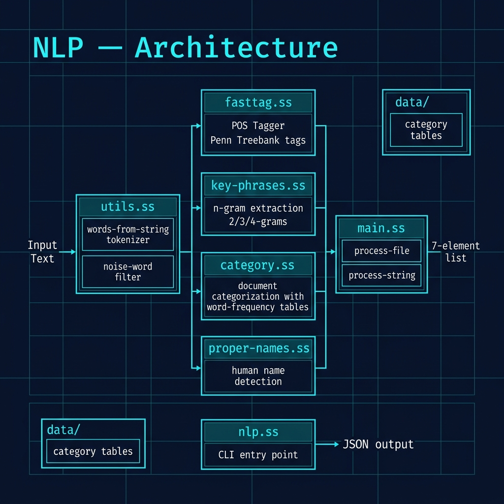

# Knowledge Books Systems NLP Library in Gerbil Scheme

**Book Chapter:** [Code for Natural Language Processing (NLP)](https://leanpub.com/read/Gerbil-Scheme/code-for-natural-language-processing-nlp) — *Gerbil Scheme in Action* (free to read online).

A pure-Gerbil Scheme NLP library ported from the author's *Knowledge Books Systems* (KBS) NLP toolkit. Given any text, it performs part-of-speech tagging, key-phrase extraction, document categorisation, and human-name detection — with no external dependencies beyond the Gerbil standard library.

## What it does

- **Part-of-speech tagging** — uses the FastTag rule-based POS tagger; returns a vector of Penn Treebank tags (`NNP`, `VBD`, `DT`, etc.)
- **Key-phrase extraction** — finds repeated 2-, 3-, and 4-word n-grams that are likely topically significant
- **Document categorisation** — scores the document against a set of category word-frequency tables (e.g. `news_economy.txt`, `news_war.txt`) and returns the top-ranked categories with scores
- **Human-name detection** — identifies likely personal names using a proper-names list

## Files

| File | Description |
|------|-------------|
| `main.ss` | Top-level API: `process-file` and `process-string` |
| `fasttag.ss` | Rule-based part-of-speech tagger |
| `category.ss` | Document categorisation engine |
| `nlp.ss` | Tokenisation and linguistic utilities |
| `utils.ss` | String/list helpers |
| `proper-names.ss` | Known personal-name list |
| `key-phrases.ss` | N-gram key-phrase extraction |
| `summarize.ss` | Summarisation helpers |
| `build.ss` | Gerbil package build script |
| `data/` | Category word-frequency tables and test corpora |

## Architecture



## Quick start

### macOS: set deployment target first (avoids OpenSSL link errors after `brew upgrade`)

```bash
export MACOSX_DEPLOYMENT_TARGET=15.0
```

### Run tests (interpreter — no compilation)

```bash
make test
cat .gerbil/test-output.json | jq
```

### Build the command-line tool and process a file

```bash
make
.gerbil/bin/nlp -i data/testdata/climate_g8.txt -o output.json
cat output.json | jq
```

### Interactive REPL session

```bash
gxi
> (import :nlp/main)
> (nlp/main#process-string "President Biden went to Congress to discuss the economy.")
```

The return value is a list of seven elements:

```
(words-vector  pos-tags-vector  key-phrases  top-categories  summary-words  human-names  place-names)
```

## Example output (abbreviated)

```json
{
  "words": ["President", "Biden", "went", ...],
  "pos-tags": ["NNP", "NNP", "VBD", ...],
  "key-phrases": ["clean energy", "developing countries"],
  "categories": [
    ["news_economy.txt", 136750],
    ["news_war.txt", 117290]
  ]
}
```

## Implementation notes

- The `make test` target deliberately uses the interpreter (`gxi`) to avoid potential dynamic-link issues on macOS after system library updates.
- The `MACOSX_DEPLOYMENT_TARGET` workaround is only needed if Gerbil was installed via Homebrew and OpenSSL was subsequently upgraded.