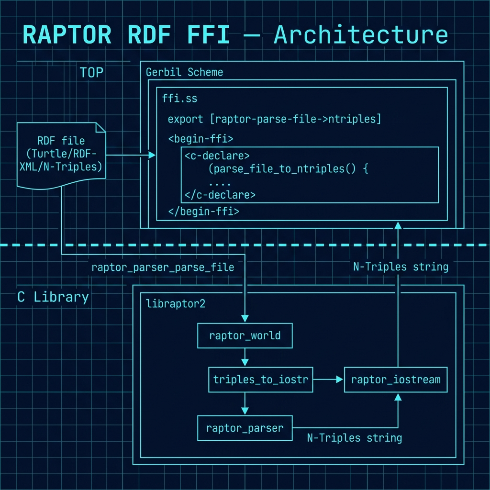

# Gerbil Scheme FFI Example: Raptor RDF Library

**Book Chapter:** [Gerbil Scheme FFI Example Using the C Language Raptor RDF Library](https://leanpub.com/read/Gerbil-Scheme/gerbil-scheme-ffi-example-using-the-c-language-raptor-rdf-library) — *Gerbil Scheme in Action* (free to read online).

This example demonstrates Gerbil Scheme's **Foreign Function Interface (FFI)** by wrapping [Raptor2](https://librdf.org/raptor/), a well-established C library for parsing RDF files. It lets you parse any RDF file (Turtle, RDF/XML, N-Triples, etc.) and get back N-Triples as a Scheme string — all from within Gerbil, with no intermediate processes.

## What it does

`ffi.ss` embeds a small C function (`parse_file_to_ntriples`) inline using Gerbil's `begin-ffi` / `c-declare` mechanism, then exposes three APIs at increasing levels of abstraction:

```scheme
;; Low-level: returns N-Triples string, or #f on error
(raptor-parse-file->ntriples filename syntax-name)

;; High-level: returns N-Triples string, raises an error on failure
(parse-rdf-file filename)              ;; defaults to syntax "guess"
(parse-rdf-file filename "turtle")     ;; explicit syntax

;; Structured: returns a list of (subject predicate object) lists
(parse-rdf-file->triples filename)
```

`test.ss` validates all three APIs by writing a temporary Turtle file, parsing it with both explicit syntax (`"turtle"`) and auto-detection (`"guess"`), testing the structured output, and verifying error handling on nonexistent files.

## Architecture



## Prerequisites

- macOS or Linux
- Gerbil Scheme (`gxc`, `gxi`)
- Raptor2 and `pkg-config`:

  **macOS (Homebrew):**
  ```bash
  brew install raptor pkg-config
  ```

  **Ubuntu/Debian:**
  ```bash
  sudo apt install libraptor2-dev pkg-config
  ```

## Build and run

```bash
make        # compiles ffi.ss and links against raptor2
./test      # runs the test suite
```

Expected output:

```
PASS turtle -> ntriples
PASS guess -> ntriples
PASS parse-rdf-file (default syntax)
PASS parse-rdf-file->triples returns 1 triple
PASS parse-rdf-file->triples structure
PASS nonexistent file returns empty string
All tests passed.
```

## Interactive REPL usage

```bash
gxi                              # start the Gerbil REPL
```

```scheme
> (import "ffi")

;; Parse a Turtle file to N-Triples
> (displayln (parse-rdf-file "data.ttl"))
<http://example.org/s> <http://example.org/p> <http://example.org/o> .

;; Get structured triples
> (parse-rdf-file->triples "data.ttl")
(("<http://example.org/s>" "<http://example.org/p>" "<http://example.org/o>"))
```

## Key FFI concepts demonstrated

| Concept | Where |
|---------|-------|
| `begin-ffi` block | Wraps all FFI declarations |
| `c-declare` | Embeds C source inline in the `.ss` file |
| `define-c-lambda` | Maps a C function to a Scheme identifier |
| `char-string` type | Passes/returns C `char*` as Scheme strings |
| Memory management | `strdup` + `raptor_free_memory` prevents leaks |

## API reference

| Function | Returns | On error |
|----------|---------|----------|
| `(raptor-parse-file->ntriples file syntax)` | N-Triples string | `#f` |
| `(parse-rdf-file file [syntax])` | N-Triples string | raises `error` |
| `(parse-rdf-file->triples file [syntax])` | list of `(s p o)` lists | raises `error` |

Supported syntax names: `"turtle"`, `"rdfxml"`, `"ntriples"`, `"guess"` (default).

## Why this matters

Most real-world Scheme programs need to call existing C libraries. Gerbil's FFI lets you do this without writing a separate shared library or using subprocess hacks. The Raptor2 example is a realistic use case: parse industry-standard RDF data directly in Scheme, enabling integration with Linked Data and Semantic Web tooling.
