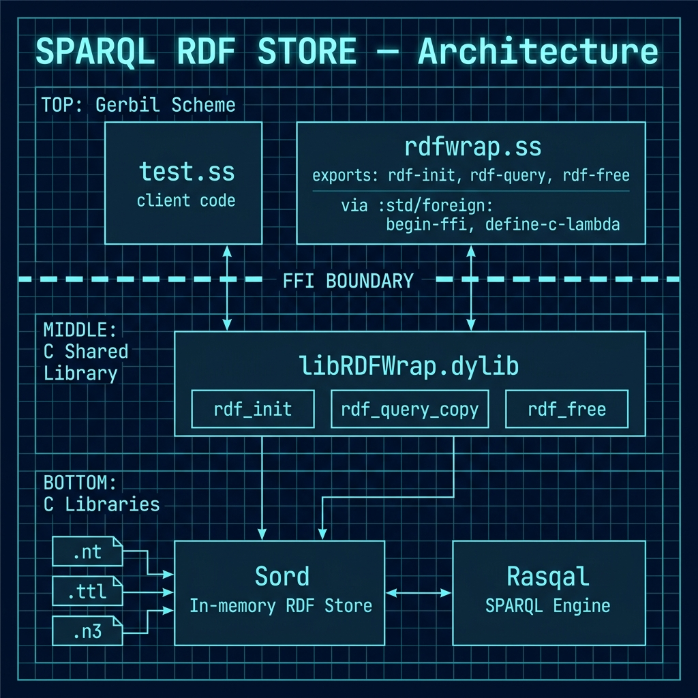

# Complete FFI Example: C Language Wrapper for Rasqal and Sord

**Book Chapter:** [Complete FFI Example: C Language Wrapper for Rasqal SPARQL Library and Sord RDF Datastore Library](https://leanpub.com/read/Gerbil-Scheme/complete-ffi-example-c-language-wrapper-for-rasqal-sparql-library-and-sord-rdf-datastore-library) — *Gerbil Scheme in Action* (free to read online).

A more advanced FFI example that wraps two production-grade C libraries — [Sord](https://drobilla.net/software/sord.html) (an in-memory RDF triple store) and [Rasqal](https://librdf.org/rasqal/) (a SPARQL query engine) — inside a shared C library (`libRDFWrap`), then calls it from Gerbil Scheme via the FFI.

This is a step up from the `RaptorRDF_FFI` example: instead of embedding C inline, it builds a separate `.dylib`/`.so` and binds to it. The result is a full SPARQL-over-RDF pipeline accessible from Scheme with real data files (N-Triples, Turtle, N3).

> **Note:** The default `Makefile` targets macOS (`.dylib`). A `Makefile.linux` is also provided for Linux.

## Prerequisites

- Gerbil Scheme (`gxi`/`gxc`)
- Homebrew (macOS):

Install:

    brew install sord
    brew install rasqal

## Architecture



```
$ make

$ ./DEMO_rdfwrap mini.nt "SELECT ?s ?p ?o WHERE { ?s ?p ?o }"
<http://example.org/article1>	<http://purl.org/dc/elements/1.1/title>	"AI Breakthrough Announced"
<http://example.org/article1>	<http://purl.org/dc/elements/1.1/creator>	<http://example.org/alice>
<http://example.org/alice>	<http://xmlns.com/foaf/0.1/name>	"Alice Smith"

$ ./DEMO_rdfwrap data.ttl "SELECT ?s ?p ?o WHERE { ?s ?p ?o }"
<http://example.org/article1>	<http://purl.org/dc/elements/1.1/title>	"AI Breakthrough Announced"
<http://example.org/article1>	<http://purl.org/dc/elements/1.1/creator>	<http://example.org/alice>
<http://example.org/article1>	<http://purl.org/dc/elements/1.1/date>	"2025-08-27"
<http://example.org/article2>	<http://purl.org/dc/elements/1.1/title>	"Local Team Wins Championship"
<http://example.org/article2>	<http://purl.org/dc/elements/1.1/creator>	<http://example.org/bob>
<http://example.org/alice>	<http://xmlns.com/foaf/0.1/name>	"Alice Smith"
<http://example.org/bob>	<http://xmlns.com/foaf/0.1/name>	"Bob Jones"
```

Gerbil client:

```
# Build the Gerbil executable
$ make TEST_client

# Usage: ./TEST_client [data-file [query]]
# Defaults to data-file=mini.nt and a simple SELECT * pattern
# You can load the query from a file by prefixing with '@' (e.g., @query.sparql)
$ ./TEST_client
<http://example.org/article1>	<http://purl.org/dc/elements/1.1/title>	"AI Breakthrough Announced"
<http://example.org/article1>	<http://purl.org/dc/elements/1.1/creator>	<http://example.org/alice>
<http://example.org/alice>	<http://xmlns.com/foaf/0.1/name>	"Alice Smith"

# Specify a data file and a custom query
$ ./TEST_client data.ttl "SELECT ?s WHERE { ?s ?p ?o } LIMIT 5"
<http://example.org/article1>
<http://example.org/article2>
<http://example.org/alice>
<http://example.org/bob>

# Or read the query from a file
$ cat > q.sparql <<'Q'
SELECT ?s WHERE { ?s ?p ?o } LIMIT 3
Q
$ ./TEST_client data.ttl @q.sparql
<http://example.org/article1>
<http://example.org/article2>
<http://example.org/alice>
```
