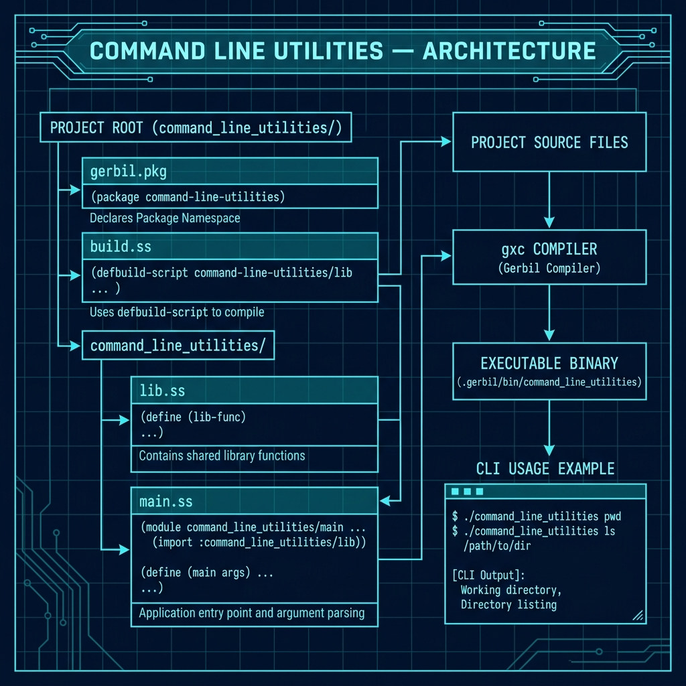

# General-Purpose Gerbil Scheme Command-Line Utility

**Book Chapter:** [Introduction To Writing Command Line Utilities](https://leanpub.com/read/Gerbil-Scheme/introduction-to-writing-command-line-utilities) — *Gerbil Scheme in Action* (free to read online).

A fuller example of a Gerbil Scheme command-line utility using the proper **package system** (`gerbil.pkg`, `build.ss`, `make`). This builds on the minimal single-file demo in `command_line_utilities_first_demo_START_HERE/` and shows how to structure a real project with library modules and a separate entry-point.

## What it does

`command_line_utilities` is a small shell-like tool that can run basic OS commands (`pwd`, `ls`) from within a Gerbil executable. It demonstrates:

- Splitting a project into a library module (`lib.ss`) and a `main.ss` entry point
- Using `gerbil.pkg` for package declaration and `build.ss` for compilation
- Installing the resulting binary into `.gerbil/bin/` for local use

## Architecture



## Prerequisites

- Gerbil Scheme (`gxi`/`gxc`)

## Build and run

```bash
make
```

This compiles the package and places the binary in `.gerbil/bin/command_line_utilities`.

```bash
.gerbil/bin/command_line_utilities --help
.gerbil/bin/command_line_utilities pwd
.gerbil/bin/command_line_utilities ls
```

### Tip: add `.gerbil/bin` to your PATH

Add the following to your `.profile`, `.bashrc`, or `.zshrc`:

```bash
export PATH=$PATH:.gerbil/bin
```

Then within any Gerbil project directory you can invoke locally-built executables directly:

```bash
command_line_utilities pwd
# → /Users/markw/GITHUB/gerbil_scheme_book/source_code/command_line_utilities/
```

## Project structure

```
command_line_utilities/
├── gerbil.pkg                  # Package declaration
├── build.ss                    # Build script (run by make)
├── Makefile
└── command_line_utilities/
    ├── lib.ss                  # Library functions
    └── main.ss                 # Entry point (exports `main`)
```

The two-level directory layout mirrors Gerbil's module naming convention: the package is `command_line_utilities` and the importable modules are `:command_line_utilities/lib` and `:command_line_utilities/main`.
