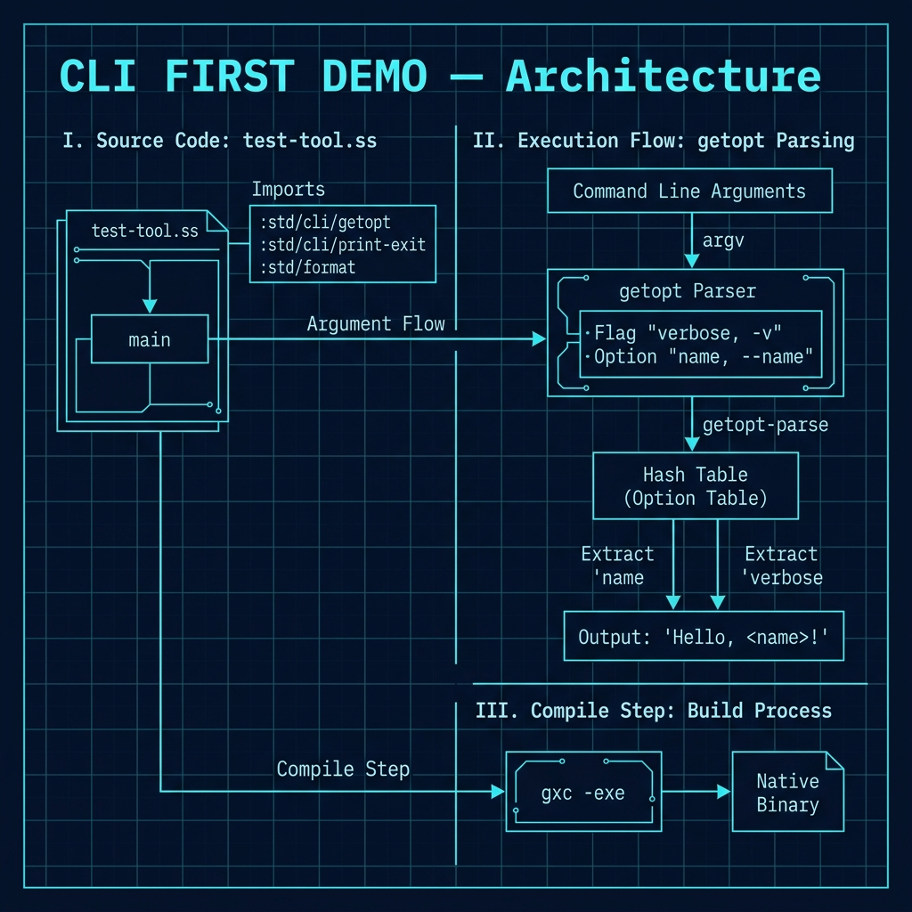

# Simple Command-Line Utility — First Demo (Start Here)

**Book Chapter:** [Introduction To Writing Command Line Utilities](https://leanpub.com/read/Gerbil-Scheme/introduction-to-writing-command-line-utilities) — *Gerbil Scheme in Action* (free to read online).

> **Start here** if you are new to Gerbil Scheme command-line programs. This is the simplest possible example of a compiled CLI tool — a single source file that uses Gerbil's built-in `getopt` library to parse flags and options.

## What it does

`test-tool.ss` is a minimal but complete CLI tool that:

- Accepts a `--name NAME` option (required)
- Accepts an optional `-v` / `--verbose` flag
- Prints `"Hello, <name>"` and exits

This demonstrates the full workflow: write a `main` procedure → compile to a native binary → run with arguments.

## Architecture



## Prerequisites

- Gerbil Scheme (`gxc` compiler)

## Build and run

```bash
# Compile to a native executable (dynamically linked)
gxc -exe -o test-tool test-tool.ss

# Run it
./test-tool --name Alice
# → Hello, Alice

./test-tool --name Mark -v
# → verbose on
# → Hello, Mark

./test-tool --help
# → usage: mytool [-v] --name=STR [ARGS...]
```

## How it works

The `main` procedure is the entry point for compiled Gerbil executables. Gerbil's `:std/cli/getopt` library handles argument parsing:

```scheme
(def (main . argv)
  (let* ((parser (getopt (flag 'verbose "-v" "--verbose")
                         (option 'name "--name" help: "Your name" value: identity)))
         (opts (getopt-parse parser argv))
         ...)
    ...))
```

- `flag` declares a boolean switch
- `option` declares a named argument with a value
- `getopt-parse` returns a hash table of parsed values

## Next step

Once you are comfortable with this example, look at the `command_line_utilities/` directory for a more feature-complete project that uses Gerbil's full package system (`gerbil.pkg`, `build.ss`, and `make`).
