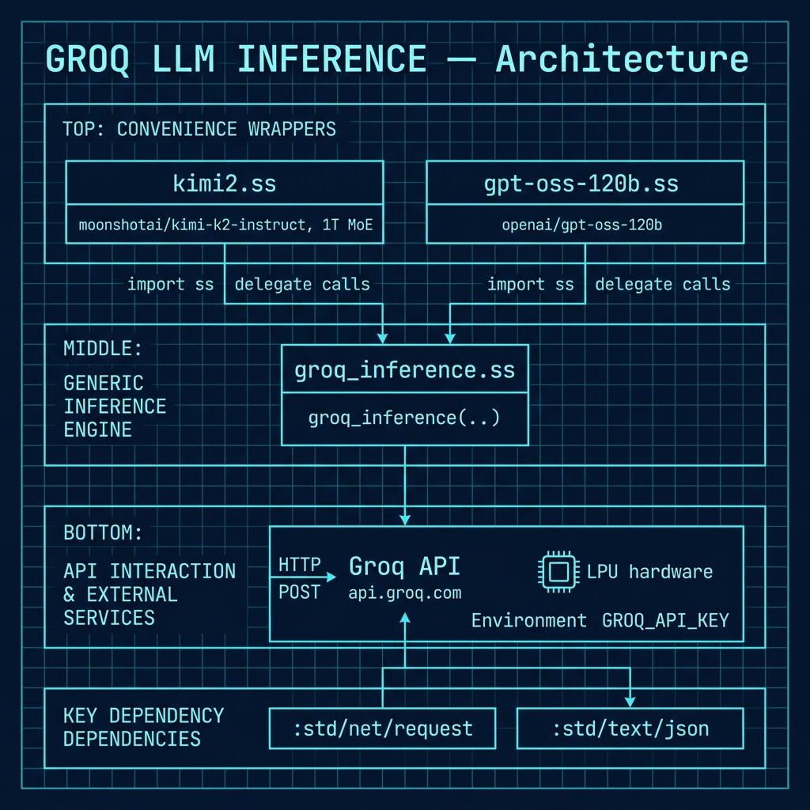

# High-Speed LLM Inference with Groq

**Book Chapter:** [Inexpensive and Fast LLM Inference Using the Groq Service](https://leanpub.com/read/Gerbil-Scheme/inexpensive-and-fast-llm-inference-using-the-groq-service) — *Gerbil Scheme in Action* (free to read online).

A Gerbil Scheme library for calling the [Groq](https://groq.com) API, which runs open-source models on custom LPU (Language Processing Unit) hardware at speeds far faster than GPU-based cloud APIs. The package includes a generic `groq_inference` helper plus two convenience wrappers for specific models.

## What makes Groq interesting

Groq's proprietary LPU hardware delivers dramatically lower latency and higher throughput than GPU-based cloud inference — often 10–20× faster token generation than comparable GPU services, at very competitive pricing. This makes it ideal for interactive applications or high-volume batch workloads.

## Prerequisites

- Gerbil Scheme (`gxi`/`gxc`)
- A Groq API key (free tier available at [console.groq.com](https://console.groq.com)):
  ```bash
  export GROQ_API_KEY="gsk_..."
  ```

## Files

| File | Description |
|------|-------------|
| `groq_inference.ss` | Core library — exports `groq_inference` procedure |
| `kimi2.ss` | Convenience wrapper for `moonshotai/kimi-k2-instruct` (1T-param MoE model) |
| `gpt-oss-120b.ss` | Convenience wrapper for `openai/gpt-oss-120b` (OpenAI open-source 120B model) |
| `Makefile` | Build and run targets |

## Architecture



## How to run

### Compile the library

```bash
make compile
# or:
gxc groq_inference.ss
```

### Interactive session with kimi2

```bash
make kimi2
# drops you into gxi with kimi2 loaded
> (import "kimi2")
> (kimi2 "Explain tail recursion in one sentence.")
```

### Interactive session with gpt-oss-120b

```bash
make gpt-oss-120b
> (import "gpt-oss-120b")
> (gpt-oss-120b "What is the halting problem?")
```

## API

### `groq_inference` (low-level)

```scheme
(groq_inference model prompt
                system-prompt: "You are a helpful assistant.")
```

Returns the response text as a string, or raises an error on API failure.

### `kimi2` (convenience wrapper)

```scheme
(kimi2 prompt
       model: "moonshotai/kimi-k2-instruct"   ; optional override
       system-prompt: "...")                    ; optional
```

Moonshot AI's Kimi K2 is a Mixture-of-Experts model with 1 trillion total parameters (32B resident). It performs well on coding and reasoning tasks.

### `gpt-oss-120b` (convenience wrapper)

```scheme
(gpt-oss-120b prompt
              model: "openai/gpt-oss-120b"  ; optional override
              system-prompt: "...")          ; optional
```

OpenAI's open-source 120B model, available through Groq's API.

## Model list and pricing

See [groq.com/pricing](https://groq.com/pricing) for the current list of supported models, context lengths, and per-token pricing.
