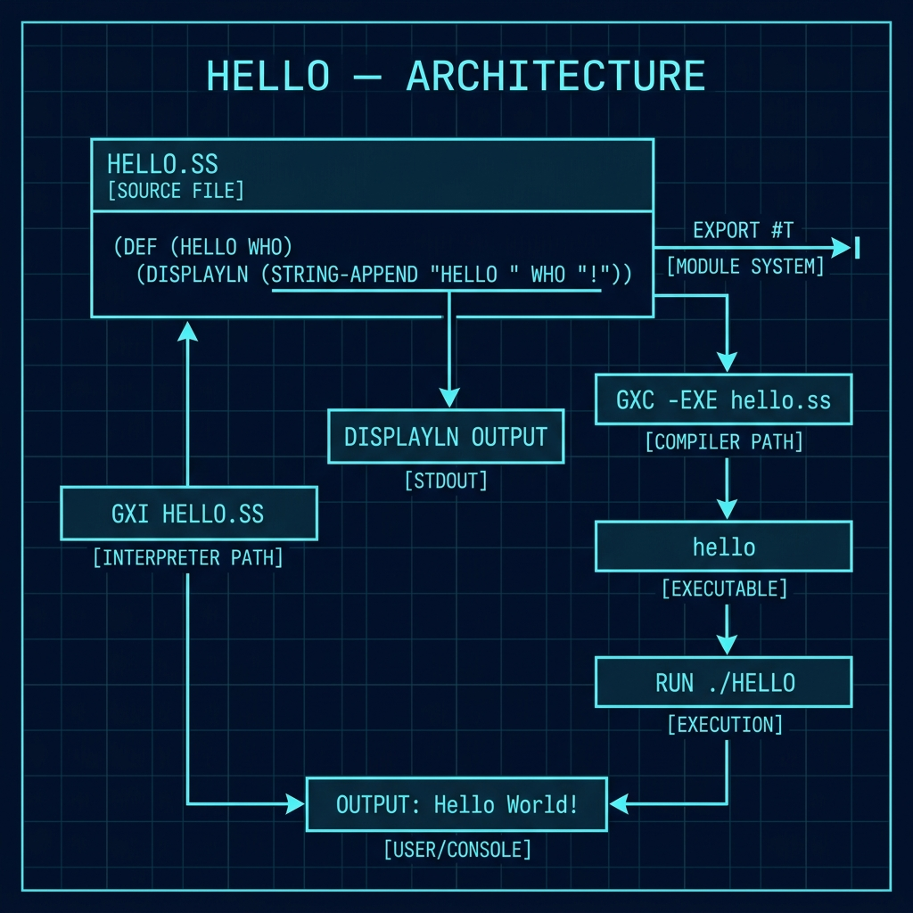

# Hello World — Getting Started with Gerbil Scheme

**Book Chapter:** [Setting Up Gerbil Scheme Development Environment](https://leanpub.com/read/Gerbil-Scheme/setting-up-gerbil-scheme-development-environment) — *Gerbil Scheme in Action* (free to read online).

This is the simplest possible Gerbil Scheme program — a `hello` function that prints a greeting. It serves as a first sanity-check that your Gerbil installation is working correctly.

## Prerequisites

- [Gerbil Scheme](https://cons.io) installed (provides `gxi` interpreter and `gxc` compiler)

## What it does

`hello.ss` defines and immediately calls a `hello` function that displays a greeting:

```scheme
(def (hello who)
  (displayln "hello " who))

(hello 'Brady)
```

## Architecture



## How to run

### Interpreted (no compilation needed)

```bash
gxi hello.ss
```

Expected output:

```
hello Brady
```

### Interactive REPL session

```bash
gxi
> (import "hello")
> (hello 'World)
hello World
```

### Compile to a native executable

```bash
gxc -exe -o hello hello.ss
./hello
```

## Why this matters

Gerbil Scheme's `displayln` is equivalent to `(display ...) (newline)`. The `def` form is Gerbil's shorthand for `define`. This tiny example demonstrates the full round-trip: write → interpret → compile, and introduces the module system (`export`/`import`) used throughout every other example in the book.
