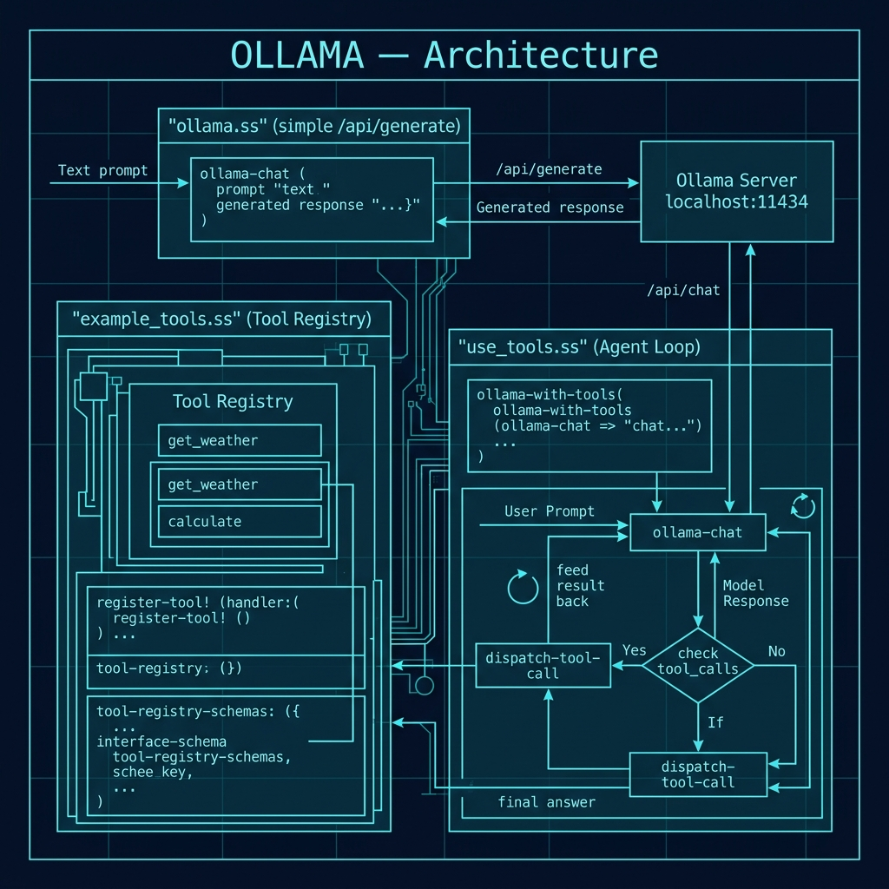

# Ollama Local LLM Inference

**Book Chapter:** [Ollama](https://leanpub.com/read/Gerbil-Scheme/ollama) — *Gerbil Scheme in Action* (free to read online).

A Gerbil Scheme library for running prompts against locally-hosted language models via [Ollama](https://ollama.com), including support for tool/function calling. No API key or internet connection required — the model runs entirely on your machine.

## Prerequisites

- Gerbil Scheme (`gxi`/`gxc`)
- [Ollama](https://ollama.com) installed and running locally
- At least one model pulled, e.g.:
  ```bash
  ollama pull gemma3        # ~2 GB — good general-purpose default
  ollama pull qwen3:1.7b    # ~1 GB — good for tool calling
  ```

## Files

| File | Description |
|------|-------------|
| `ollama.ss` | Simple library — exports `ollama` procedure (uses `/api/generate`) |
| `example_tools.ss` | Tool definitions — registry, schemas, and example handlers (get_weather, calculate) |
| `use_tools.ss` | Tool-calling library — exports `ollama-with-tools` (uses `/api/chat` with tool dispatch loop) |
| `gerbil.pkg` | Package declaration |

## Architecture



## How to run

### Simple completion (ollama.ss)

```bash
gxi
> (import "ollama")
> (ollama "Why is the sky blue? Be very concise.")
"The sky appears blue due to Rayleigh scattering ..."
```

### Tool calling (use_tools.ss)

```bash
gxi
> (import "example_tools" "use_tools")
> (ollama-with-tools
    "Use the get_weather tool: What's the weather like in Paris?"
    default-tool-registry)
```

The agent loop will:
1. Send the prompt with tool schemas to the model
2. If the model requests a tool call, execute the handler and feed the result back
3. Repeat until the model returns a final text answer

### Use a different model

```scheme
;; Simple completion
(ollama "Write a haiku about Scheme." model: "qwen3:0.6b")

;; Tool calling
(ollama-with-tools "What is 6 * 7?" default-tool-registry
                   model: "qwen3:1.7b")
```

## API

### `ollama.ss`

```scheme
(ollama prompt
        model: "gemma3:latest")   ; optional — any model you have pulled
```

Returns the response text as a string.

### `example_tools.ss`

```scheme
(make-tool-registry)                              ; create empty registry
(register-tool! registry name desc params handler) ; register a tool
(tool-registry-lookup registry name)               ; look up a tool
(tool-registry-schemas registry . tool-names)      ; get API schemas
default-tool-registry                              ; pre-built with get_weather + calculate
```

### `use_tools.ss`

```scheme
(ollama-with-tools prompt registry
                   model: "qwen3:1.7b"   ; optional
                   max-rounds: 5)        ; optional — safety limit
```

Runs an agent loop and returns the final response text as a string.

## Notes

- `ollama.ss` uses `http://localhost:11434/api/generate` (non-streaming)
- `use_tools.ss` uses `http://localhost:11434/api/chat` (required for tool calling)
- Ollama must be running (`ollama serve`) before calling any function
- To see available models: `ollama list`
- This is ideal for private/offline use cases where you cannot or do not want to send data to a cloud API
