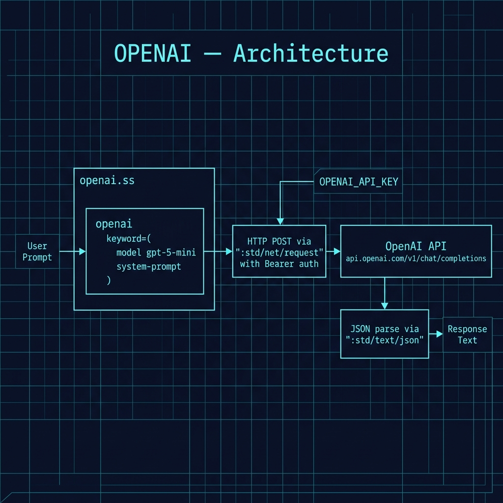

# OpenAI API Examples

**Book Chapter:** [OpenAI API](https://leanpub.com/read/Gerbil-Scheme/openai-api) — *Gerbil Scheme in Action* (free to read online).

A minimal Gerbil Scheme library for calling the [OpenAI Chat Completions API](https://platform.openai.com/docs/api-reference/chat). The `openai` procedure sends a user prompt (with an optional system prompt) and returns the model's response as a plain Scheme string.

## Prerequisites

- Gerbil Scheme (`gxi`/`gxc`)
- An OpenAI API key — set the environment variable:
  ```bash
  export OPENAI_API_KEY="sk-..."
  ```

## Files

| File | Description |
|------|-------------|
| `openai.ss` | Library module — exports `openai` procedure |
| `gerbil.pkg` | Package declaration (`openai`) |

## Architecture



## How to run

### Interactive REPL

```bash
gxi
> (import "openai")
> (openai "Why is the sky blue? Be concise.")
"The sky is blue due to Rayleigh scattering ..."
```

### Use a custom model and system prompt

```scheme
(openai "Translate 'hello world' to French."
        model: "gpt-4o-mini"
        system-prompt: "You are a professional translator.")
```

## API

```scheme
(openai prompt
        model: "gpt-4o-mini"                           ; optional
        system-prompt: "You are a helpful assistant.") ; optional
```

Returns the response text as a string, or raises an error on API failure.

## Notes

- Calls `https://api.openai.com/v1/chat/completions` using the standard chat format
- The API key is read at call time from `OPENAI_API_KEY`
- Change the default `model:` keyword to `"gpt-4o"` or any other model you have access to
- This library follows the same pattern as the `gemini` and `groq_llm_inference` modules in this book, making it easy to swap between providers
